# アーキテクチャレビュー: auto_opt

> **注意（2026-06-29）**: このドキュメントは旧アーキテクチャ（legacy/以下のスクリプト群）のレビューです。
> 現行アーキテクチャは `docs/spec_overview.md` を参照してください。
> 指摘事項の多くは現行版で対処済みです（`run.py` オーケストレーター・`data_dir` 設定化・`sweep_phi.py` 直接出力化など）。

> 対象論文: "Origin of Layered Herringbone Packing and Polymorphism in Polyacenes: A Quantum Chemical Optimization Approach" (Ono et al., JACS submitted)
> レビュー日: 2026-05-02

---

## 1. 論文の4段階最適化とコードの対応

### 論文の手法概要

ポリアセン結晶構造を段階的に最適化する手法。各ステップで「vdW接触モデルによる粗探索 → AMBER FF近似最適化 → DFT-D精密最適化」の3段構えを繰り返す。

| ステップ | 論文の名称 | 最適化対象 | 評価エネルギー |
|---|---|---|---|
| Step 1 | Intralayer | α, a, b, z | Eintra(8) = 2E₁+2E₂+4E₃ |
| Step 2 | Inclination | φ(θincl, φincl) | Eintra(6) |
| Step 3 | Interlayer | cx, cy, cz | Einter(7) |
| Step 4 | Refinement | 非一様傾斜/twist | Eint(near) |

---

## 2. データフロー全体図

```mermaid
flowchart TD
    subgraph PRE["前処理: Monomer Preparation"]
        XYZ["monomer.xyz\n(入力)"]
        PREP["monomer/prep_monomer.py\n・XYZ→CSV(vdW半径付き)\n・Gaussian ESPジョブ投入\n・antechamber RESP→mol2\n・sander単分子エネルギー"]
        MONO_CSV["data/monomer/*.csv"]
        MONO_MOL2["data/monomer/*.mol2\n(RESP charges, gaff2型)"]
        AMBER_REF["data/amber_ref/*_gaff2.out\n(単分子基準E)"]
        XYZ --> PREP
        PREP --> MONO_CSV
        PREP --> MONO_MOL2
        PREP --> AMBER_REF
    end

    subgraph STEP1["Step 1: Intralayer最適化 (α, a, b, z)"]
        direction TB
        subgraph S1_CRUDE["Crude Search (vdW接触モデル)"]
            VDW_SWEEP["vdw/sweep.py\n・α×β×z 格子スキャン\n・剛体球接触条件TorF判定\na=2R·cosβ, b=2R·sinβ"]
            VDW_CSV["vdW_r_contact_*.csv\n(α, β, z, R_clps, TorF)"]
            EXTRACT["vdw/extract_init.py\n・TorF=True区間の端点抽出\n→a-stack/b-stack候補"]
            INIT_CSV["step1_init_params.csv\n(α, a, b, z, status=NotYet)"]
            VDW_SWEEP --> VDW_CSV --> EXTRACT --> INIT_CSV
        end

        subgraph S1_AMBER["AMBER FF 粗精密探索 (ヒルクライミング)"]
            AMBER_DRV["amber/driver_gene.py\n・listen()ループ (polling)\n・init_params→±0.1刻みで近傍探索\n・E=2E1+2E2+4E3≒Eintra(8)"]
            MAKE_IO["amber/make_io_gene.py\n・ダイマー座標生成(get_monomer_xyzR)\n・ダイマーmol2書き出し\n・tleap.in/job.sh生成\n・subprocess実行(sander)"]
            AMBER_OUT["amber/*.out\n(sander実行結果)"]
            STEP1_CSV["step1.csv, step1_1.csv\nstep1_2.csv, step1_3.csv\n(α,a,b,z,E1,E2,E3,status)"]
            INIT_CSV --> AMBER_DRV
            AMBER_REF --> AMBER_DRV
            MONO_MOL2 --> MAKE_IO
            AMBER_DRV -- "exec_gjf()呼び出し" --> MAKE_IO
            MAKE_IO --> AMBER_OUT
            AMBER_OUT --> AMBER_DRV
            AMBER_DRV --> STEP1_CSV
        end

        subgraph S1_DFT["DFT-D 精密探索 (Gaussian)"]
            PIPE1["gaussian/pipeline.py\npipeline_v3.py\n・step1.csvから(a,b)局所最小抽出\n・3ダイマー(a1,b1,t1)→.inp生成\n・qsub投入(SGE/throttle制御)"]
            GAUSS_INP["gaussian/*.inp\n(B3LYP/6-311G** GD3\nCounterpoise=2)"]
            GAUSS_LOG["gaussian/*.log\n(Gaussian実行結果)"]
            FILTERED["filtered_step1.csv\n(α,a,b,z,dft_status)"]
            COLLECT1["gaussian/collect.py\n・.logからdft_get_E()解析\n・E=2E1+2E2+4E3\n・structure_type付与"]
            DFT_RES["dft_results.csv\n(α,a,b,z,E,E1,E2,E3\nstatus,structure_type)"]
            SELECT1["gaussian/select_minima.py\n・(α,z)2D局所最小抽出\n・反射境界条件\n・a-stack/b-stack/ch別出力"]
            MINIMA1["minima.a_stack.csv\nminima.b_stack.csv"]

            STEP1_CSV --> PIPE1
            PIPE1 --> GAUSS_INP & FILTERED
            GAUSS_INP -- "g16 実行" --> GAUSS_LOG
            GAUSS_LOG --> COLLECT1
            FILTERED --> COLLECT1
            COLLECT1 --> DFT_RES
            DFT_RES --> SELECT1
            SELECT1 --> MINIMA1
        end
    end

    subgraph STEP2["Step 2: Inclination最適化 (φ追加: 長軸傾斜θincl, φincl)"]
        direction TB
        subgraph S2_CRUDE["Crude Search (phi付きvdW)"]
            VDW_PHI["vdw/sweep_phi.py\n・α×φ×β×z スキャン\n(φ=x軸回転=長軸傾斜に対応)"]
            VDW_PHI_CSV["vdW_r_contact_*.csv\n(alpha,phi,beta,z,R_clps,TorF)"]
            EXTRACT_PHI["vdw/extract_init_phi.py\n・a-stack/b-stack/local_min分類\n・(z,α,φ)グループで端点抽出"]
            INIT_PHI["step1_init_params.csv\n(alpha,phi,a,b,z,status,structure_type)"]
            VDW_PHI --> VDW_PHI_CSV --> EXTRACT_PHI --> INIT_PHI
        end
        subgraph S2_AMBER["AMBER FF (phi対応)"]
            AMBER_PHI["amber/driver_gene_phi.py\n(make_io_gene_phi.py)\nE=2E1+2E2+4E3"]
            STEP1_PHI["step1.csv (phi列あり)"]
            INIT_PHI --> AMBER_PHI --> STEP1_PHI
        end
        subgraph S2_DFT["DFT-D (phi対応)"]
            PIPE2["gaussian/pipeline_v3.py\n(phi列対応版)\nN-form/G-form候補生成"]
            COLLECT2["gaussian/collect_phi.py\n(phi,z)でstructure_type付与"]
            SELECT2["gaussian/select_minima_phi.py"]
            MINIMA2["minima_phi.*.csv\n(N-form/G-form/R-form候補)"]
            STEP1_PHI --> PIPE2 --> COLLECT2 --> SELECT2 --> MINIMA2
        end
    end

    subgraph STEP3["Step 3: Interlayer最適化 (cx, cy, cz)"]
        direction TB
        S3_NOTE["【入力】Step1/2の最適化済み\n(α,a,b,z,phi)を固定"]
        subgraph S3_AMBER["AMBER FF (14ペア)"]
            STK_DRV["stacking/driver_stacking_v3.py\n・vdW接触でcz初期値推定\n・(cx,cy)格子スキャン\n・czはScipy minimize_scalarで最適化\n非同期ループ(running_jobs管理)"]
            STK_IO["stacking/make_io_stacking.py\n・14ダイマー座標生成\n  (α分子7ペア + -α分子7ペア)\n・14×mol2+tleap.in書き出し\n・1job.shで連続実行\nE_inter(7) ≒ Σ14ペア/対称性"]
            STK_OUT["amber/*/*.out × 14\n(cx,cy,cz ごと)"]
            CY_RES["cy_scan_results.csv\n(cx,cy,cz_abs,d_opt,E_total)"]
            S3_NOTE --> STK_DRV
            MONO_MOL2 --> STK_IO
            STK_DRV -- "exec_amber_job()" --> STK_IO
            STK_IO --> STK_OUT
            STK_OUT --> STK_DRV
            STK_DRV --> CY_RES
        end
        subgraph S3_MERGE["結果統合"]
            MERGE["stacking/merge_results.py\nstacking/merge_csv.py"]
            STACK_RES["step1_stacking.csv\n(全パラメータ統合)"]
            CY_RES --> MERGE --> STACK_RES
        end
    end

    subgraph STEP4["Step 4: Refinement (非一様傾斜/twist)"]
        direction TB
        subgraph S4_ASYM["Type IV: 非一様傾斜 (asym)"]
            ASYM_DRV["amber/driver_gene_phi_asym.py\ndriver_gene_phi_asym_anti.py\n・α1≠α2の非一様傾斜\n・inversion symmetryを保持"]
            ASYM_PIPE["gaussian/pipeline_v3_asym.py\ncollect_phi_asym.py"]
        end
        subgraph S4_SCREW["Type III: twist最適化 (screw)"]
            SCREW_DRV["amber/driver_gene_screw.py\n・θ_twistパラメータ追加\n・G-form出発点"]
            SCREW_PIPE["gaussian/pipeline_screw.py\ncollect_asym.py"]
        end
        S4_NOTE["【入力】Step3の最適化済み\n(cx,cy,cz)も可変"]
        S4_NOTE --> ASYM_DRV & SCREW_DRV
        ASYM_DRV --> ASYM_PIPE
        SCREW_DRV --> SCREW_PIPE
        FINAL["最終結晶構造\nType I (R-form)\nType II (N1-form)\nType III (G+twist)\nType IV (N2+asym)"]
        ASYM_PIPE & SCREW_PIPE --> FINAL
    end

    subgraph ORCH["Orchestrator"]
        FLOW["flow/run.py\n【注意】Step1のみ自動化\nStep2〜4は手動実行"]
    end

    MONO_CSV --> VDW_SWEEP & VDW_PHI
    MINIMA1 --> S3_NOTE
    MINIMA2 --> S3_NOTE
    STACK_RES --> S4_NOTE

    style PRE fill:#e8f4f8,stroke:#2196F3
    style STEP1 fill:#e8f8e8,stroke:#4CAF50
    style STEP2 fill:#fff8e8,stroke:#FF9800
    style STEP3 fill:#f8e8f8,stroke:#9C27B0
    style STEP4 fill:#f8e8e8,stroke:#F44336
    style ORCH fill:#f0f0f0,stroke:#607D8B
```



---

## 3. 各モジュールと論文ステップの詳細対応表

| 論文のステップ | コードモジュール | パラメータ対応 | 備考 |
|---|---|---|---|
| **Pre-Step** | `monomer/prep_monomer.py` | XYZ → CSV+mol2 | Gaussian(ESP)+antechamber(RESP)+sander |
| **Step 1 Crude** | `vdw/sweep.py` | α→`alpha`, β→`beta`, z→`z` | TorF=True区間がvdW接触OK配置 |
| **Step 1 Init** | `vdw/extract_init.py` | a=2R·cosβ, b=2R·sinβ | 端点のみ（または局所最小も）抽出 |
| **Step 1 AMBER** | `amber/driver_gene.py` | E=2E₁+2E₂+4E₃≒Eintra(8) | ±0.1刻みヒルクライミング |
| **Step 1 DFT** | `gaussian/pipeline.py` / `pipeline_v3.py` | B3LYP/6-311G** GD3, CP=2 | 3ダイマー(a1,b1,t1)を1 `.inp`に連結 |
| **Step 1 結果** | `gaussian/collect.py` + `select_minima.py` | structure_type: a-stack/b-stack/ch | (α,z) 2D局所最小 |
| **Step 2 Crude** | `vdw/sweep_phi.py` | φ→`phi`(x軸回転=θincl相当) | α×φ×β×zの4次元格子スキャン |
| **Step 2 Init** | `vdw/extract_init_phi.py` | α,φ,a,b,z + structure_type | a-stack/b-stack/local_minフィルタ可 |
| **Step 2 AMBER** | `amber/driver_gene_phi.py` | phi列追加のstep1.csv | `make_io_gene_phi.py`使用 |
| **Step 2 DFT** | `gaussian/pipeline_v3.py` + `collect_phi.py` | phi列対応 | N-form/G-form候補選別 |
| **Step 3** | `stacking/driver_stacking_v3.py` | cx,cy,cz ↔ 論文のx,y,z(層間) | 14ペア ≒ Einter(7)×2(対称性で等価) |
| **Step 3 IO** | `stacking/make_io_stacking.py` | α分子7ペア + −α分子7ペア | `get_14_pairs_xyzR()` |
| **Step 4 Type IV** | `amber/driver_gene_phi_asym*.py` + `gaussian/pipeline_v3_asym.py` | α1≠α2(非一様傾斜) | θ'incl, φ'inclに対応 |
| **Step 4 Type III** | `amber/driver_gene_screw.py` + `gaussian/pipeline_screw.py` | θ_twist | G-form出発点のtwist最適化 |

---

## 4. 論文との変数名・設計上の差異

| 項目 | 論文 | コード | 差異の内容 |
|---|---|---|---|
| 長軸傾斜の表現 | θincl + φincl（2変数） | `phi`（1変数） | コードの`phi`はx軸回転角で、SIの数式(Zt, Zpを介した変換)を暗黙に内包。論文の2変数系との対応は非自明 |
| 層間変位 | x, y, z（層間） | `cx`, `cy`, `cz` | 命名が完全に異なる |
| `z`の二重定義 | 文脈依存 | Step1/2では「T字ペアの半層高さ」、Step3では「層間距離`cz`」 | **同じ変数名`z`が異なる物理量に使われており混乱の源** |
| α（ヘリンボーン角） | 2α = θHB | `alpha`（片側角α） | 一致 |
| Eintra(8)の分解 | 4 T字型 + 4 SP型 = 8近傍 | 4×E3(t1) + 2×E1(a1) + 2×E2(b1) | 数値的には同値。`t1`ダイマーが論文T字型に対応 |
| 層間近傍数 | Einter(7)：7近傍 | 14ペア（α分子×7 + −α分子×7） | 対称性を陽に考慮せず全ペアを計算している |

---

## 5. 物理ロジックと外部I/Oの密結合箇所（アーキテクチャ指摘）

### 🔴 重大な問題

#### 5-1. `amber/make_io_gene.py: exec_gjf()` — 3層責務の混在

**場所:** `amber/make_io_gene.py:348-371`

```python
def exec_gjf(auto_dir, monomer_name, params_dict, structure_type, isTest):
    # ① 幾何計算（物理ロジック）
    make_xyzfile(...)            # GaussView用XYZ座標の計算
    # ② ファイル書き出し（I/O）
    open(gv_dir/xyzfile_name)   # → ディスク書き込み
    make_gjf_xyz(...)            # → AMBER mol2ファイルを書き出す（関数内で書き込みまで行う）
    get_one_exe(...)              # → tleap.in / job.sh の書き込み
    # ③ 外部プロセス実行（計算実行）
    subprocess.run([file_job])
```

**問題:** 幾何生成・ファイル書き出し・subprocess実行が1関数に縛られているため、「座標だけ取得してテストしたい」「書き出しのみ確認したい」が不可能。`make_gjf_xyz()`も内部でファイル書き出しまで行っており、座標生成とI/Oが不可分。`isTest=True`にしてもsubprocessをスキップするだけで、mol2ファイル等は必ず生成される。

---

#### 5-2. `stacking/make_io_stacking.py: exec_14pairs_energy()` — 計算パイプライン全体が1関数

**場所:** `stacking/make_io_stacking.py:146-206`

```python
def exec_14pairs_energy(...):
    pairs = get_14_pairs_xyzR(...)     # ① 物理ロジック（座標生成）
    for dimer in pairs:
        mol2_lines = get_xyzR_lines(...)
        open(mol2_path).write(...)      # ② I/O（mol2書き出し）
        open(tleap_in_path).write(...)  # ② I/O（tleap.in書き出し）
    subprocess.run(full_cmd, ...)       # ③ AMBER実行
    for out_file in out_files:
        E_list = amber_get_E(out_file)  # ④ I/O（結果ファイル読み込み）
    return total_E                      # ⑤ 数値を返す
```

**問題:** 「座標計算→ファイル書き出し→外部実行→ファイル読み込み→エネルギー返却」が単一関数に完全に統合されており、個々の段階を単体でテスト・再利用することが不可能。エラー発生時もどの段階で失敗したか特定しにくい。

---

#### 5-3. `gaussian/pipeline.py` / `pipeline_v3.py: get_xyzR_lines()` — 計算設定が座標生成に混入

**場所:** `gaussian/pipeline.py:59-83`, `gaussian/pipeline_v3.py:82-106`

```python
def get_xyzR_lines(xyzR_array, file_description, machine_type):
    mp_num = MACHINE_SPEC[machine_type]["nproc"]
    header = [
        '%mem=15GB\n',
        f'%nproc={mp_num}\n',
        '#P B3LYP/6-311G** EmpiricalDispersion=GD3 Counterpoise=2\n',  # ← DFT計算レベル
        ...
    ]
    # ↑ Gaussian固有ヘッダー（I/O/実行設定）
    for i, (x, y, z, Rv) in enumerate(xyzR_array):
        atom = R2atom(Rv)
        lines.append(f'{atom}(Fragment={frag}) ...')
    # ↑ 座標フォーマット変換（物理ロジック）
```

**問題:** 「ダイマー座標をGaussian形式に変換する」という物理ロジックと、「使用マシンのnproc・基底関数・DFT汎関数の選択」というソフトウェア実行設定が同一関数に記述されている。計算レベルを変えるだけで関数修正が必要。また `MACHINE_SPEC` と `MAX_PARALLEL` がモジュールトップレベルにハードコードされており、設定ファイル化されていない。

---

#### 5-4. `amber/driver_gene.py: listen()` — ポーリング・状態管理・ジョブ投入が密結合

**場所:** `amber/driver_gene.py:63-201`

```python
def listen(auto_dir, monomer_name, num_nodes, isTest):
    df_E_1 = pd.read_csv(auto_csv_1)           # ① CSVポーリング（I/O）
    amber_get_E(log_filepath1)                  # ② 結果ファイル読み込み（I/O）
    df_E_1.to_csv(auto_csv_1, index=False)      # ③ CSV書き戻し（I/O）
    exec_gjf(auto_dir, monomer_name, ...)        # ④ 次のジョブ投入（実行制御）
    # ...（step1_1〜step1_3の3系統で上記を繰り返す）
    isDone = (完了率チェック)
    return isDone
```

**問題:** 「何がどこまで計算済みか」というステート管理（CSVへの読み書き）と、「次の計算点をどう選ぶか」というヒルクライミングアルゴリズム（物理的意思決定）が完全に絡み合っている。さらにstep1_1・step1_2・step1_3の3系統について同一パターンが繰り返されており、コード量が肥大化している。

---

### 🟡 軽微な問題

#### 5-5. `utils.py` — 物理量とファイルパーサの混在

**場所:** `utils.py`

| 関数 | 分類 |
|---|---|
| `Rod()` | 物理ロジック（回転行列） |
| `vdw_radius()`, `R2atom()` | 物理定数テーブル |
| `amber_get_E()` | I/O（AMBERログパーサ） |
| `dft_get_E()` | I/O（Gaussianログパーサ） |

**問題:** 純粋な物理計算関数とファイルフォーマット解析関数が同一モジュールに同居。`amber_get_E()`や`dft_get_E()`はAMBER/Gaussianの出力フォーマットに依存しており、ソフトウェアバージョン変更で破綻しやすい。

#### 5-6. 環境依存ハードコードパス

**場所:** `gaussian/pipeline.py:25`, `gaussian/pipeline_v3.py:36`
```python
MONOMER_DIR = os.path.expanduser("~/Working/auto_opt/data/monomer")
```

**場所:** `stacking/driver_stacking_v3.py:5`
```python
os.environ['HOME'] = '/home/miyoshi'  # ← プロセス全体のHOMEを上書き
```

後者は特に危険で、サブプロセス（sander, tleap等）を含むプロセスツリー全体のHOME環境変数を書き換えてしまう。他の計算が同一環境で動いている場合、予期しない副作用を生む可能性がある。

---

## 6. 推奨するリファクタリング方針

### 基本原則

物理ロジック層・データ変換層・I/O層・実行制御層の4層を明確に分離する。

```
┌─────────────────────────────────────┐
│  実行制御層 (driver_*.py)             │  ← ジョブ投入・ポーリング・状態管理
├─────────────────────────────────────┤
│  I/O層 (io_*.py / parsers.py)        │  ← ファイル読み書き・フォーマット変換
├─────────────────────────────────────┤
│  データ変換層 (formatter_*.py)        │  ← ソフト固有フォーマット生成（AMBER mol2, Gaussian inp）
├─────────────────────────────────────┤
│  物理ロジック層 (geometry.py 等)      │  ← 座標計算・回転行列・vdW半径
└─────────────────────────────────────┘
```

### 具体的な改善項目

#### A. `exec_gjf()` の分割（優先度: 高）

```python
# Before（現状）: 1関数に全て
exec_gjf(auto_dir, monomer_name, params_dict, structure_type, isTest)

# After（改善後）: 責務の分離
coords = build_dimer_coords(monomer_name, params_dict, structure_type)  # 物理ロジック
mol2_path = write_mol2(coords, monomer_name, out_dir)                   # I/O
job_path  = write_amber_job(mol2_path, monomer_name, out_dir)           # I/O
if not isTest:
    submit_job(job_path)                                                  # 実行制御
```

#### B. Gaussianヘッダーの設定ファイル化（優先度: 中）

```python
# Before（現状）: 計算レベルがget_xyzR_lines()にハードコード
'#P B3LYP/6-311G** EmpiricalDispersion=GD3 Counterpoise=2\n'

# After（改善後）: 設定オブジェクトを外部から注入
@dataclass
class GaussianConfig:
    functional: str = "B3LYP"
    basis: str = "6-311G**"
    dispersion: str = "GD3"
    mem: str = "15GB"
    nproc: int = 40

def write_gaussian_inp(coords, config: GaussianConfig, out_path): ...
```

#### C. `listen()` のステート管理と探索アルゴリズムの分離（優先度: 中）

```python
# Before（現状）: CSVポーリングとヒルクライミングが混在
def listen(auto_dir, monomer_name, num_nodes, isTest): ...

# After（改善後）
def get_next_candidates(completed: dict) -> list[dict]:
    """ヒルクライミング純粋ロジック（I/O不要）"""
    ...

class JobStateManager:
    """CSVを使ったジョブ状態管理（物理量に依存しない）"""
    def load(self): ...
    def mark_done(self, key, energy): ...
    def get_pending(self): ...
```

#### D. ファイルパーサの分離（優先度: 低）

```python
# Before（現状）: utils.pyに物理量と混在
def amber_get_E(file): ...    # AMBERログパーサ
def dft_get_E(file): ...      # Gaussianログパーサ
def Rod(n, theta): ...        # 回転行列

# After（改善後）: 専用モジュールへ切り出し
# parsers/amber_parser.py
def parse_amber_energy(path: Path) -> float: ...

# parsers/gaussian_parser.py
def parse_gaussian_energies(path: Path) -> list[float]: ...
```

#### E. 環境依存ハードコードの除去（優先度: 高）

`stacking/driver_stacking_v3.py:5` の `os.environ['HOME'] = '/home/miyoshi'` は即時削除すること。パス解決が必要な場合は `Path(__file__).resolve().parents[N]` を使って相対パスで取得する（他の多くのモジュールで既に採用済みのパターン）。

---

## 7. `flow/run.py` のカバレッジ

現状の `flow/run.py` が自動化しているのは **Step 1のみ（vdW sweep → extract → AMBER → Gaussian pipeline → collect）**。Step 2〜4は手動実行が必要。

```
flow/run.py カバー範囲:
  [✓] monomer.xyz の解決
  [✓] vdw/sweep.py
  [✓] vdw/extract_init.py
  [✓] amber/driver_gene.py（driver という名前で呼ぶが実体は driver_gene.py を想定）
  [✓] gaussian/pipeline.py
  [✓] gaussian/collect.py
  [ ] Step 2: vdw/sweep_phi.py 以降
  [ ] Step 3: stacking/driver_stacking_v3.py 以降
  [ ] Step 4: driver_gene_phi_asym*.py 以降
```

また `flow/run.py:38` に構文エラーがある（`action="true"` は `action="store_true"` の誤り）。

---

*このドキュメントは自動生成されたアーキテクチャレビューです。コードベースの変更に伴い定期的な更新を推奨します。*
